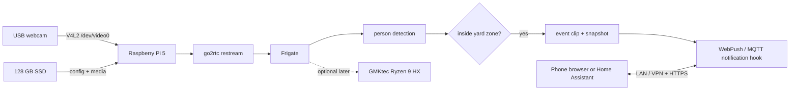

# Pi Yard Watch

A reproducible, privacy-conscious yard camera stack for a Raspberry Pi 5, a USB
webcam, and Frigate. It starts with person-only detection on the Pi and leaves a
clean migration path to an AMD Ryzen mini PC if inference or storage becomes too
heavy.

> [!IMPORTANT]
> This repository contains templates, not a ready-to-expose internet service.
> Keep Frigate on a trusted LAN or VPN. Do not forward its ports from your router.

## Architecture



Frigate bundles go2rtc. The webcam is opened once by go2rtc and its local RTSP
restream supplies Frigate's detect and record roles.

## Repository layout

```text
config/config.example.yml    Frigate template (safe to commit)
docker-compose.yml           Pi-only service
docs/                        Deployment, notifications, offload, security
scripts/setup.sh             Host checks and local configuration
scripts/validate.sh          Static and live validation
scripts/diagnose-camera.sh   Enumerate webcam modes
scripts/phase1-readiness.sh  Verify the Pi host before deployment
```

See [ROADMAP.md](ROADMAP.md) for the phased implementation plan and exit criteria.

## Quick start on the Pi

Use 64-bit Raspberry Pi OS (Bookworm or newer), attach the SSD, webcam, and a
proper Pi 5 power supply, then clone this repository onto the SSD.

```bash
cp .env.example .env
# Edit .env, especially TZ and CAMERA_DEVICE.
./scripts/diagnose-camera.sh
./scripts/setup.sh
# Adjust the resolution and yard polygon in config/config.yml.
./scripts/validate.sh
docker compose up -d
docker compose logs -f frigate
```

Open `https://PI_ADDRESS:8971`. On first startup, the generated admin password is
printed in the container logs. Expect a browser warning until trusted HTTPS is
configured. Detailed steps are in [docs/pi-deployment.md](docs/pi-deployment.md).

The sample `yard` polygon covers the full frame so the stack is testable. Replace
it in Frigate's **Settings → Camera configuration → Masks / Zones** before relying
on alerts. Zone membership uses the bottom-center of a person's bounding box.

## Defaults and retention

- one 1280×720 webcam stream encoded at 10 FPS; detection sampled at 3 FPS
- only the `person` object label
- alerts, detections, and snapshots require the `yard` zone
- no continuous retention; motion segments for 1 day
- alert/detection recordings and person snapshots for 7 days
- 192 MB shared memory and a 512 MB RAM-backed segment cache
- MQTT and native notifications disabled until deliberately configured

Actual storage use varies with scene motion, codec, bitrate, and webcam. Watch the
SSD during the first week and tune retention in the Frigate UI.

## Validation and operations

```bash
./scripts/validate.sh             # before starting
docker compose up -d              # start
docker compose ps                 # status
curl -kfsS https://localhost:8971/api/version
docker compose pull && docker compose up -d  # update stable image
docker compose down               # stop; recordings remain
```

Run `docker compose config` before every deploy. The `stable` tag tracks the
current stable release; for repeatable production upgrades, replace it with a
tested version tag and update intentionally.

## Publish to GitHub

This repository has no remote by default. Create an **empty** GitHub repository
named `raspberry-pi-yard-watch` (do not add a README, license, or `.gitignore`),
then run:

```bash
git remote add origin git@github.com:YOUR_GITHUB_USER/raspberry-pi-yard-watch.git
git push -u origin main
```

If you use HTTPS instead of SSH, use
`https://github.com/YOUR_GITHUB_USER/raspberry-pi-yard-watch.git` and authenticate with a
credential helper or personal access token—never paste a token into a remote URL.
Confirm tracked files with `git status` and `git ls-files` before the first push.

## Notifications and optional offload

See [docs/notifications.md](docs/notifications.md) for native phone WebPush and
the MQTT/Home Assistant hook, and [docs/gmktec-offload.md](docs/gmktec-offload.md)
for moving the whole Frigate service to the Ryzen system. Frigate's MQTT review
events are the supported integration hook; no cloud notification credential is
stored here.

## Security and privacy

Read [docs/security-and-privacy.md](docs/security-and-privacy.md) before placing
the camera. In short: minimize the field of view, respect neighboring property,
use strong unique credentials, use HTTPS through a VPN/reverse proxy for remote
access, encrypt the SSD if your threat model requires it, and never commit `.env`,
`config/config.yml`, databases, recordings, credentials, or device identifiers.

## Raspberry Pi 5 caveat

Frigate documents a Raspberry Pi 4 V4L2 decode device (`/dev/video11`), but does
not prescribe that path for Pi 5. This project therefore makes no unverified
hardware-decoding claim. Start without `hwaccel_args`, confirm stable video, then
measure CPU load, inference speed, dropped frames, and temperature. CPU detection
is a practical trial configuration for one camera, but an accelerator or the
GMKtec may be preferable for sustained use.

## License

[MIT](LICENSE). Frigate is a separate project with its own license.
