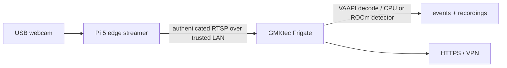

# Optional GMKtec Ryzen offload

Offload only after measuring the Pi. The simplest supported topology is to move
the entire Frigate container and media storage to the GMKtec, leaving the Pi as a
small webcam-to-RTSP edge streamer. Splitting only inference into a remote custom
detector adds failure modes and is not the recommended first migration.

## Migration outline

1. Benchmark Pi CPU, thermals, detector speed, dropped frames, and storage.
2. Put the GMKtec on wired Ethernet and install a bare-metal Debian/Ubuntu host
   with Docker Engine and Compose.
3. Run a maintained RTSP restreamer on the Pi (go2rtc or MediaMTX) and bind it to
   the trusted LAN only. Configure authentication; do not expose raw RTSP online.
4. Copy this repository to the GMKtec. Change `go2rtc.streams.yard_camera` from
   the local FFmpeg device to the Pi's RTSP URL. Remove the webcam `devices` entry
   from Compose.
5. Move `config/` and recordings during a maintenance window, or start with a new
   database. Keep one writer for the media path.
6. Validate CPU detection first. Then test AMD decode/inference separately and
   retain a known-good rollback configuration.

## AMD considerations

Frigate can use VAAPI on modern AMD GPUs for video decoding; map the appropriate
`/dev/dri/renderD*` device and use the upstream-recommended VAAPI preset. Some AMD
systems require `LIBVA_DRIVER_NAME=radeonsi`.

For AMD GPU object inference, use Frigate's `stable-rocm` image only after
confirming the exact integrated/discrete GPU and ROCm support. Ryzen product names
alone do not prove compatibility. CPU-backed OpenVINO is the lower-complexity
baseline for one camera and gives a useful comparison.

Do not combine an unverified decode change, detector change, and host migration
in one step. Confirm live view/recording, then decode, then detection.

Current upstream references: [video decoding](https://docs.frigate.video/configuration/hardware_acceleration_video/),
[object detectors](https://docs.frigate.video/configuration/object_detectors/),
and [hardware recommendations](https://docs.frigate.video/frigate/hardware/).
